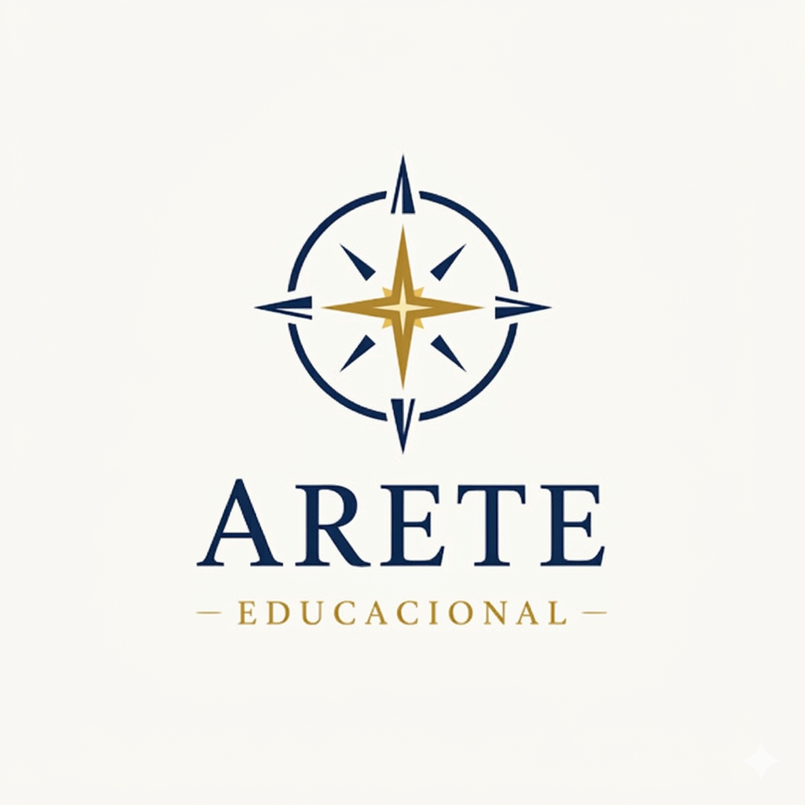

# Arete Educacional

## Significado Original

Na Grécia clássica, *Arete* significava excelência plena no cumprimento da própria natureza — não era só "ser bom em algo". Era tornar-se a melhor versão possível de quem você foi criado para ser.

Para os gregos, arete envolvia:

- Virtude moral
- Excelência intelectual
- Desenvolvimento do caráter
- Disciplina
- Sabedoria

> Um guerreiro tinha arete quando lutava com coragem.
> Um filósofo tinha arete quando buscava a verdade.
> Um cidadão tinha arete quando vivia com virtude.

Era excelência aplicada à própria vocação.

## Relação com Educação

Na filosofia grega — principalmente com Sócrates, Platão e Aristóteles — a educação tinha como objetivo formar pessoas capazes de viver com arete. Não era apenas ensinar conteúdo, mas formar o caráter e a alma.

Por isso o nome é tão forte.

**Arete Educacional** comunica algo muito profundo:

- Educação para excelência humana
- Formação do caráter
- Desenvolvimento integral

> Não é "ensino". É formação de pessoas.

## Nossa Logo



**Conceito:** bússola minimalista com estrela central — direção, orientação, formação integral.

**Sensação transmitida:** jornada, orientação, formação integral.

### Paleta de Cores

| Cor | Hex |
|-----|-----|
| Azul profundo | `#1F3A5F` |
| Dourado clássico | `#C9A227` |
| Off-White | `#F5F2E8` |

> Sabedoria, tradição e valor intelectual.

## As 52 Virtudes do Ano

O currículo de virtudes é organizado em 13 temas mensais, com 4 virtudes por mês — uma por semana.

| Mês | Tema | Virtudes |
|-----|------|----------|
| Janeiro | Fundamentos do caráter | Gratidão, Obediência, Atenção, Responsabilidade |
| Fevereiro | Autodisciplina | Perseverança, Pontualidade, Organização, Diligência |
| Março | Temperança (autodomínio) | Autocontrole, Moderação, Paciência, Sobriedade |
| Abril | Fortaleza | Coragem, Resiliência, Determinação, Confiança |
| Maio | Justiça | Honestidade, Lealdade, Generosidade, Respeito |
| Junho | Humildade e aprendizado | Humildade, Docilidade, Escuta, Gratuidade |
| Julho | Virtudes intelectuais | Curiosidade, Amor à verdade, Sabedoria, Discernimento |
| Agosto | Vida em comunidade | Amizade, Cooperação, Cortesia, Hospitalidade |
| Setembro | Trabalho e excelência | Capricho, Esforço, Constância, Excelência |
| Outubro | Interioridade | Silêncio, Reflexão, Autoconhecimento, Prudência |
| Novembro | Liderança moral | Serviço, Magnanimidade, Inspiração, Responsabilidade social |
| Dezembro | Virtudes elevadas | Esperança, Caridade, Alegria, Paz |
| Fechamento | Encerramento do ciclo | Fidelidade, Integridade, Gratidão profunda, Amor ao bem |


## Fluxo da Feature: Formação de Virtudes

### 1. Onboarding

Na primeira vez no app, a família vê:

> *”A educação não forma apenas a mente. Forma o caráter.”*

Explicação: *”No Arete, sua família desenvolverá uma virtude a cada semana através de histórias, reflexões e pequenas práticas diárias.”*

**[Começar jornada de virtudes]**

---

### 2. Configuração Inicial

- Quantos filhos deseja acompanhar?
- Para cada filho: nome e idade

> Virtudes podem ter abordagens diferentes por idade.

---

### 3. Dashboard Principal

**Exemplo — João, 9 anos:**

| | |
|---|---|
| 📚 | Estudos do dia |
| 🛡️ | Virtude da semana: **Perseverança** |
| 📖 | Leitura recomendada |

**[Ver jornada da semana]**

---

### 4. Página da Virtude da Semana

Estrutura em 4 blocos:

**Bloco 1 — Compreender**
> *”Perseverança é continuar fazendo o que é certo, mesmo quando é difícil.”*

**[Ver história inspiradora]**

**Bloco 2 — História**

História curta de personagens como Thomas Edison, Abraham Lincoln, Santos Dumont.

Pergunta final: *”O que essa pessoa fez quando tudo parecia difícil?”*

**[Refletir]**

**Bloco 3 — Reflexão**

- Você já desistiu de algo difícil?
- Quando é importante continuar tentando?
- ✏️ *(campo opcional para registrar reflexão)*

**[Ir para prática]**

**Bloco 4 — Prática da semana**

*”Durante esta semana vamos treinar perseverança.”*

Sugestões:
- Terminar uma tarefa difícil
- Tentar novamente quando errar
- Não desistir rápido

**[Registrar hoje]**

---

### 5. Registro Diário

Tela simples — tempo total: ~10 segundos.

> Hoje você praticou perseverança?

**🙂 Sim** &nbsp; **😐 Mais ou menos** &nbsp; **🙁 Não**

Campo opcional: *”Quer registrar um exemplo?”*
> *”Terminei um exercício difícil de matemática.”*

---

### 6. Linha do Tempo da Semana

| Seg | Ter | Qua | Qui | Sex |
|-----|-----|-----|-----|-----|
| 🙂 | 🙂 | 😐 | 🙂 | 🙂 |

---

### 7. Revisão Semanal

Notificação no domingo: *”Hora da revisão da virtude da semana.”*

- O que aprendemos essa semana?
- Foi fácil ou difícil praticar?
- Qual momento mostrou perseverança?
- ✏️ *(registrar memória da semana)*

> Isso vira um **diário educacional da família**.

---

### 8. Relatório Semanal

**Virtude: Perseverança**

- ✔ 5 dias praticando
- ✏️ 3 exemplos registrados

> *”João está desenvolvendo perseverança.”*
> Sugestão: continuar treinando na próxima semana.

---

### 9. Nova Virtude

Na segunda-feira seguinte, o ciclo reinicia com uma nova virtude:

✨ *Generosidade*

---

### 10. Mapa de Formação do Caráter

Gráfico de evolução anual da criança:

```
João — Evolução do caráter

Autodisciplina      ███████░░
Relações humanas    ████████░
Vida intelectual    █████░░░░
Liderança moral     ████░░░░░
```

---

### 11. Relatório Anual

No final do ano, o app gera automaticamente um **Relatório de Formação do Caráter**:

- Virtudes trabalhadas ao longo do ano
- Exemplos registrados pela família
- Evolução por eixo de caráter

> 📄 Exportável como PDF para os pais.